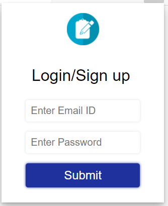
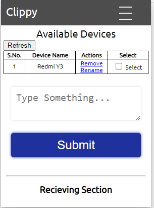
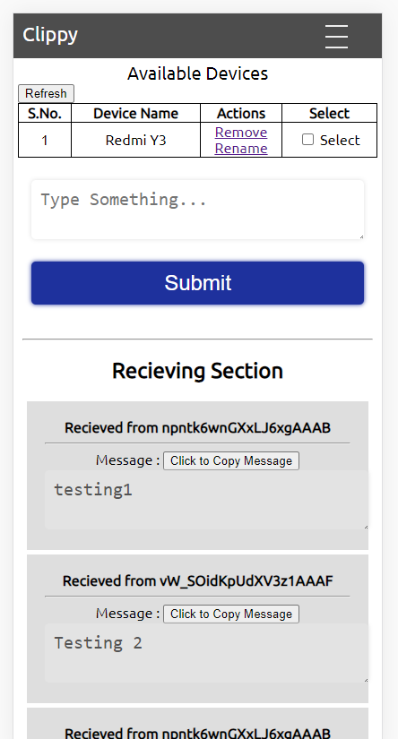

# Clippy-EasyToShare
## Hack InOut Submission
### Team Name - Promise Resolvers

Member 1 - Pushpendra V. ( pushpendrahpx )
Member 2 - Pooja Paliwal ( poojapaliwal )

This Repository can be as submission for Hackathon InOut (2020), which includes our project Clippy-EasyToShare, which helps users to increase their productivity by easily sharing some files or small texts or links across multiple devices easily in minimum efforts


This repository contains Backend Logic and Web Application basically the build inside ```web``` directory 
Code For Web Application is Here in [WebAppRepository](https://github.com/Pushpendrahpx/angularClippyExtension)

Steps For Web Application Are Mentioned in the Above Repositories

#### Requirements for Local Setup of Repository 
1. MongoDB
2. node.js
3. npm

#### Steps of Installation For Server (Locally) or Server Hosted is Available at [Here](https://shareable.tech)
1. ``` npm install ``` on Root directory after cloning repository
2. ``` npm start ``` on Root Directory

#### Steps of Installation of Chrome extension of Our Application
1. Enable Developer's mode in Your Browser
2. Unpack our Extension in folder named ``` mainExtension ``` present inside in our Root Directory

And Enjoy the Sync-ing Service Across Browser's

#### Some Working Screenshots



